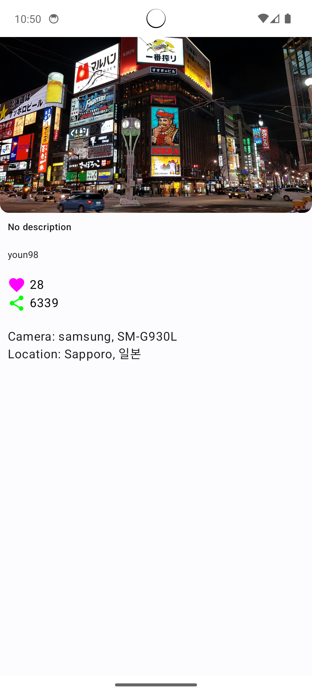
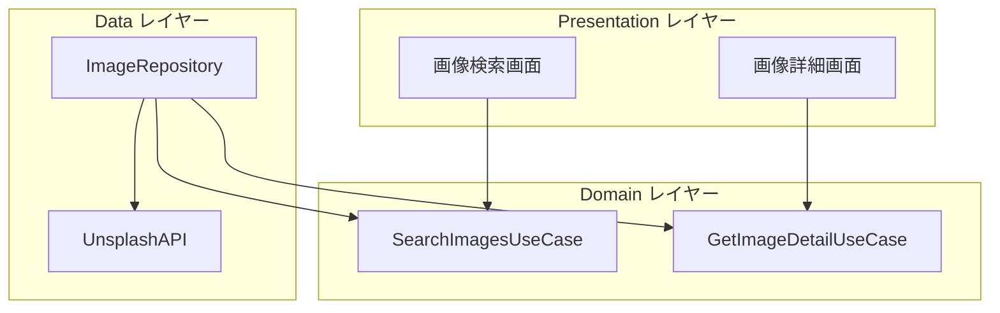

# ImageSearchApp

- UnsplashAPIを使用した画像検索アプリ
- システムテーマごとに色を変更する

## 画面仕様

**検索画面**

- 検索バー
    - キーワードで検索可能
- 各アイテムに表示する要素
    - 画像
    - 画像の説明
    - アップロードユーザー
    - いいね数
- アイテムタップで詳細画面に遷移する

 画面表示時                      | 検索時                      
----------------------------|--------------------------
  |  

---

**詳細画面**

- 各項目を表示する
    - 画像
    - 画像の説明
    - アップロードユーザー名
    - いいね数
    - シェア数
    - カメラ
    - ロケーション

詳細画面

## アーキテクチャ

