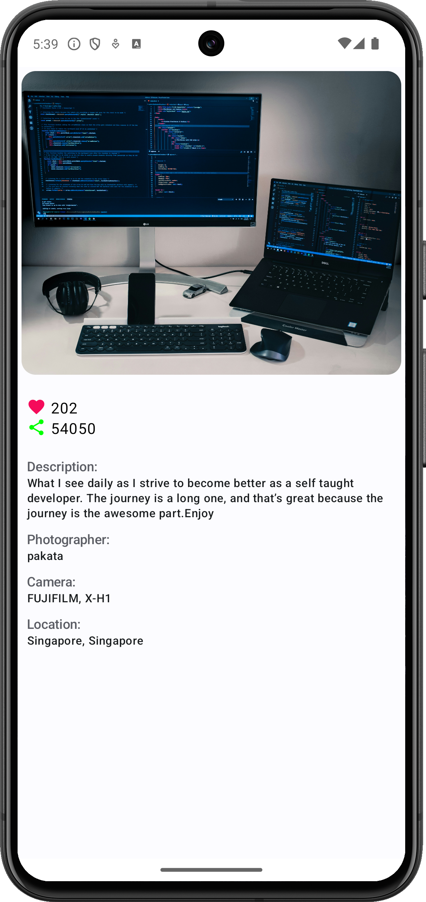

# ImageSearchApp

- UnsplashAPIを使用した画像検索アプリ
- システムテーマ(ライト/ダーク)ごとに色を変更する

## 使用技術

 

 

## 構成

## アプリ操作

https://github.com/shmzzzz/ImageSearchApp/assets/85086833/47e3a2a2-8e8d-4013-b775-b584f8e41061

## 画面仕様

**画像検索画面**

- 検索バー
    - キーワードで検索可能
- 各アイテムに表示する要素
    - 画像
    - 画像の説明
    - アップロードユーザー
    - いいね数
- アイテムタップで詳細画面に遷移する

 画面表示時               | 検索時               
---------------------|-------------------
  |  

---

**画像詳細画面**

- 各項目を表示する
    - 画像
    - 画像の説明
    - アップロードユーザー名
    - いいね数
    - シェア数
    - カメラ
    - ロケーション

詳細画面

